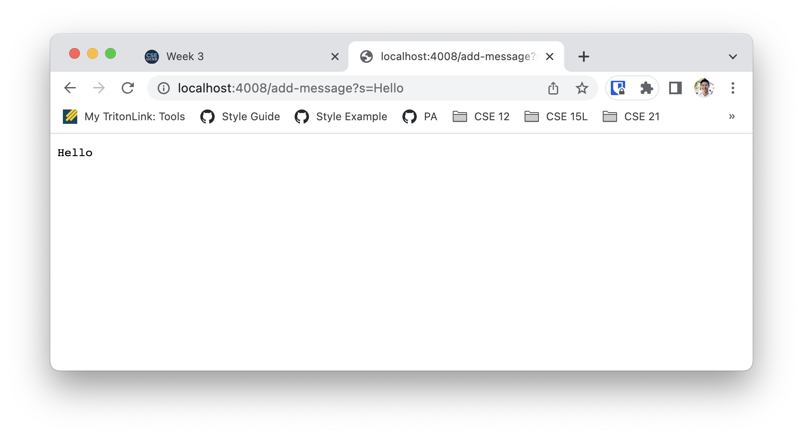
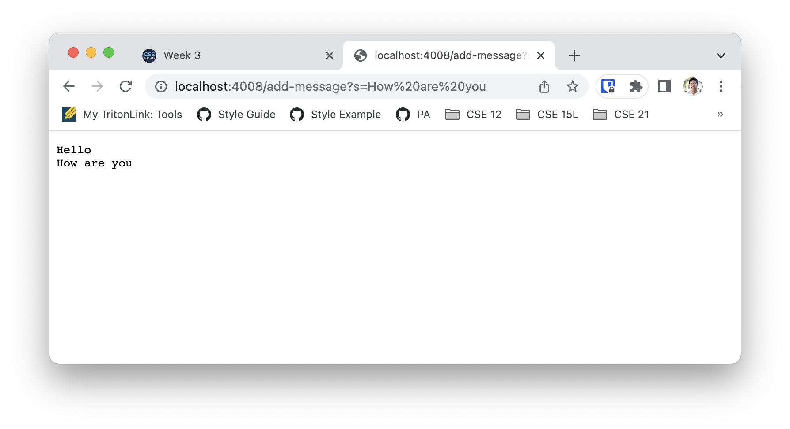
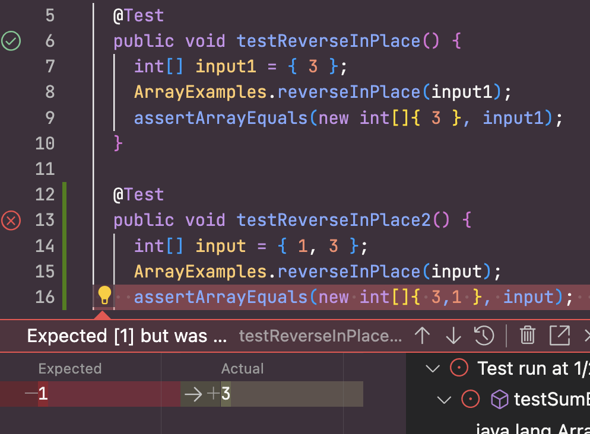

# Part 1: Webserver

Code: 
```java
import java.io.IOException;
import java.net.URI;
import java.util.ArrayList;

class Handler implements URLHandler {
    
    ArrayList<String> StringList = new ArrayList<>();
    String output = "";

    public String handleRequest(URI url) {
        if (url.getPath().contains("/add-message")) {
            String[] parameters = url.getQuery().split("=");
            if (parameters[0].equals("s")) {
                StringList.add(parameters[1]);

                output = "";
                for (int i=0; i<StringList.size(); i++) {
                    output += StringList.get(i) + "\n";
                }

                return output;
            }
        }
        return "404";
    }
}

class StringServer {
    public static void main(String[] args) throws IOException {
        if(args.length == 0){
            System.out.println("Missing port number! Try any number between 1024 to 49151");
            return;
        }

        int port = Integer.parseInt(args[0]);

        Server.start(port, new Handler());
    }
}
```

Methods that code calls: <br>
The code makes a call to the `handleRequest()` method.

Relevant arguments and fields: <br>
A URI called `url` is passed into `handleRequest()` as a parameter. The value of `url` is `http://localhost:4008/add-message?s=Hello`. `url` is further broken down into two url paramters--`s` and whatever comes after `s=`, in this case, `Hello`. Inside of `handleRequest()`, there is an ArrayList called `StringList` to keep track of all of the messages previously passed as queries. At this time, `StringList` is equal to `[ ]`.

How are values of relevant fields changed: <br>
With every call to `/add-message`, the ArrayList `StringList` is changed. The query that is in the URL after `s=` is added to `StringList` every time the URL is called. After `/add-message?s=Hello` as seen in the screenshot, the value of `StringList` is `[ "Hello" ]`.



Methods that code calls: <br>
The code makes a call to the `handleRequest()` method.

Relevant arguments and fields: <br>
A URI called `url` is passed into `handleRequest()` as a parameter. The value of `url` is `http://localhost:4008/add-message?s=How%20are%20you`. Because spaces are not allowed in URLs, when the user types `http://localhost:4008/add-message?s=How are you`, `%20` is inserted wherever there is a space in order to signal that there is a space without actually leaving a gap. `url` is further broken down into two url paramters--`s` and whatever comes after `s=`, in this case, `Hello`. Inside of `handleRequest()`, there is an ArrayList called `StringList` to keep track of all of the messages previously passed as queries. At this time, `StringList` is equal to `[ "Hello" ]`.

How are values of relevant fields changed: <br>
With every call to `/add-message`, the ArrayList `StringList` is changed. The query that is in the URL after `s=` is added to `StringList` every time the URL is called. After `/add-message?s=How%20are%20you` as seen in the screenshot, the value of `StringList` is `[ "Hello", "How are you" ]`.


# Part 2: A Bug

## Tests
Failure inducing input:
```java
    @Test
    public void testReverseInPlace2() {
        int[] input = { 1, 3 };
        ArrayExamples.reverseInPlace(input);
        assertArrayEquals(new int[]{ 3,1 }, input);
    }
```

Input that doesn't induce a failure: 

```java
    @Test 
	public void testReverseInPlace() {
        int[] input1 = { 3 };
        ArrayExamples.reverseInPlace(input1);
        assertArrayEquals(new int[]{ 3 }, input1);
	}
```

Code associated with the above two tests:
```java
    static void reverseInPlace(int[] arr) {
        for(int i = 0; i < arr.length; i += 1) {
        arr[i] = arr[arr.length - i - 1];
        }
    }
```

## Symptom 



Instead of the output being `{ 3,1 }`, it was `{ 3,3 }`.

## Bug

Before: 
```java
    static void reverseInPlace(int[] arr) {
        for(int i = 0; i < arr.length; i += 1) {
        arr[i] = arr[arr.length - i - 1];
        }
    }
```

After: 
```java
    static void reverseInPlace(int[] arr) {
    
        int[] temp = new int[arr.length];
        for (int i=0; i < arr.length; i++) {
        temp[i]=arr[i];
        }

        for(int i = 0; i < arr.length; i += 1) {
        arr[i] = temp[arr.length - i - 1];
        }
    }
```
The issue was that the array was being overwritten before the value could be properly copied over to the opposite side of the array. In order to fix this issue, I first made a copy of the array `arr` and stored it in `temp`. I then reversed the elements by taking from the opposite index in `temp` and overriding the current value in `arr`. This solves the issue because even though the values in `arr` are being overridden, the values in `temp` are still intact, and thus does not follow the same problem of copying an element that was already overridden. 

# Part 3: Something I learned
I learned how to utilize paths and queries in a java server and how they were handled. I have a litte experience with URLs with React Router. However, here I learned what a query is, how it is programmed, and what it looks like in a URL bar.