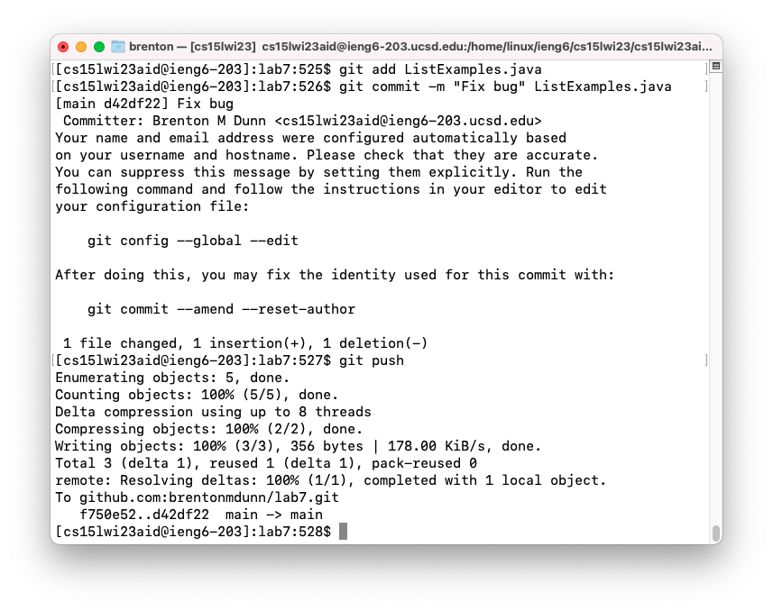
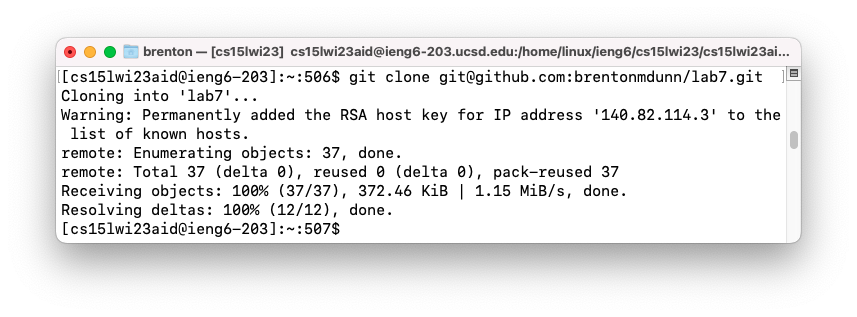
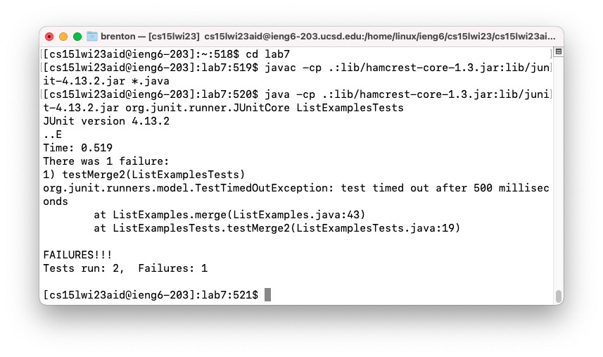
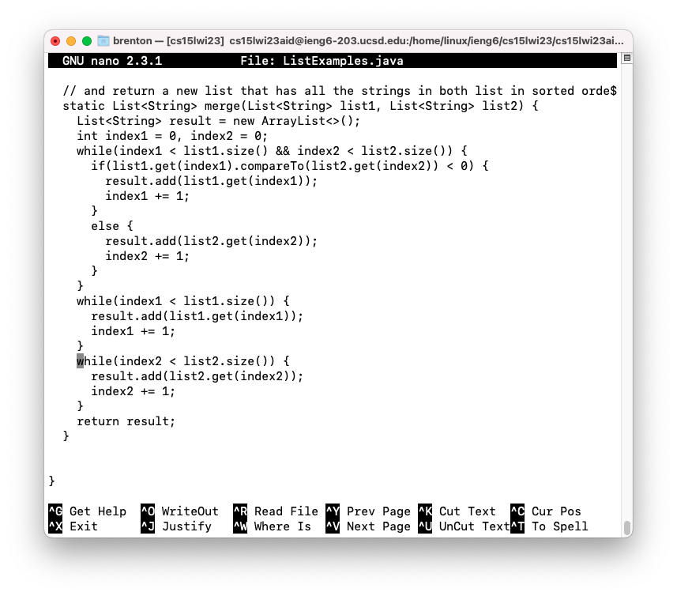
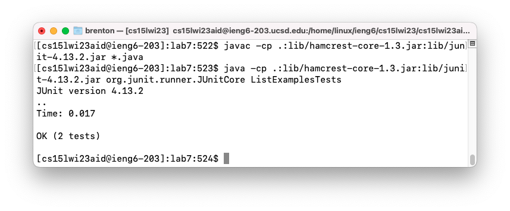
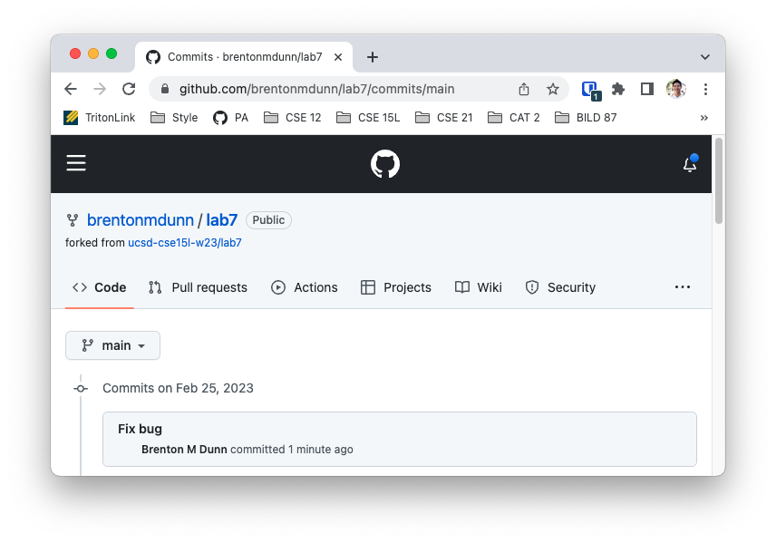

## Step 4

Keys pressed:

ssh cs15lwi23aid@ieng6.ucsd.edu `<enter>`

Description:

I first ssh’d into my ieng6 account. Because I’ve generated an ssh key, I didn’t need to type my password in. 

## Step 5

Keys pressed: 

git clone cmd-v `<enter>`

Description:
I cloned the repository using the ssh link `git@github.com:brentonmdunn/lab7.git` that I copied from GitHub.

## Step 6

Keys pressed:

cd lab7 `<enter>`

cmd-v `<enter>`

cmd-v ListExamplesTests `<enter>`

Descripton:

I cd'd into the directory that the tests were in. In order to run the tests, I copied the commands `javac -cp .:lib/hamcrest-core-1.3.jar:lib/junit-4.13.2.jar *.java` and `java -cp .:lib/hamcrest-core-1.3.jar:lib/junit-4.13.2.jar org.junit.runner.JUnitCore` from week 3 on the CSE15L course website. As the screenshot shows, 2 tests ran and 1 failed.

## Step 7

Keys pressed: 

nano Li `<tab>` .java `<enter>`

cmd-w while(index2 < `<enter>`

`<down>` `<down>` 

`<up>` `<up>` `<up>` `<up>` `<up>` `<up>` `<up>` `<up>` `<backspace>` 2

ctrl-x y `<enter>`

Description: 

Using `nano`, I navigated to the erroneous code with the search feature and edited it.

## Step 8

Keys pressed:

`<up>` `<up>` `<enter>`

`<up>` `<up>` `<enter>`

Description:

The two commands to compile and run the JUnit tests were two above in the history, so I just used the `<up>` arrow keys to navigate to them. As seen by the screenshot, both tests now pass.

## Step 9

Keys pressed:

git add L `<tab>` .java `<enter>`

git commit -m “Fix bug” L `<tab>` `<enter>`

Description:

I committed and pushed the edited file from the terminal. As seen in the 2nd screenshot, the changes have been successfully pushed to GitHub.