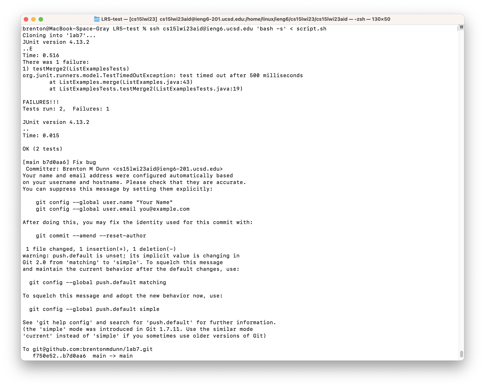

# An In-Depth Look at a Bash Script for Week 7

A bash script can be used to execute many commands really quickly and without the need for a human to type the commands in. During lab, we were tasked to do the following steps:

1. Log into ieng6
2. Clone your fork of the repository from your Github account
3. Run the tests, demonstrating that they fail
4. Edit the code file to fix the failing test
5. Run the tests, demonstrating that they now succeed
6. Commit and push the resulting change to your Github account

For this lab report, my goal was to use a Bash script so that I would only need to run one command for all six steps to execute. While creating this script, there were two main challenges: getting the script to run on `ssh` and finding and fixing the bug in the code through a script.

## Challenge 1: Running the script on `ssh`

After a bit of Googling, I learned that I could execute my script by doing the usual `ssh` commands but then using my script, which was saved on my local machine, as input redirection.

My script was named `script.sh`. The command I settled on was to run

```sh
$ ssh cs15lwi23aid@ieng6.ucsd.edu 'bash -s' < script.sh
```

## Challenge 2: Finding and fixing the bug

This proved to be the hardest part of creating the script because the only command line tool we learned to edit a file was `nano`. This wasn't going to work here. I used ChatGPT and asked it "linux command to replace a word in file". It suggested the command `sed`. I then looked up various documentation on `sed`. The [GeeksforGeeks](https://www.geeksforgeeks.org/sed-command-in-linux-unix-with-examples/) article proved to be the most helpful. The line I settled on was

```sh
$ sed -i '41, 45 s/index1 += 1;/index2 += 1;/' ListExamples.java
```

- The `-i` saves the change in the file
- The `41, 45` limits the changes to between lines `41` and `45` because there are other instances of `index += 1;` that we do not want to change.
- `sed` follows the structure `s/<item to relace>/<item to replace wtih>`, so `s/index1 += 1;/index2 += 1;/` finds an instance of `index1 += 1;` and replaces it with `index2 += 1;`, fixing out bug

## Bash script

After I had overcome all of the challenges, my final Basch script called `script.sh` and looked like the following: 

```sh
# Clone repo and cd into directory
git clone git@github.com:brentonmdunn/lab7.git
cd lab7

# Initial JUnit tests
javac -cp .:lib/hamcrest-core-1.3.jar:lib/junit-4.13.2.jar *.java
java -cp .:lib/hamcrest-core-1.3.jar:lib/junit-4.13.2.jar org.junit.runner.JUnitCore ListExamplesTests

# Locate and fix bug
sed -i '41, 45 s/index1 += 1/index2 += 1/' ListExamples.java

# Run JUnit tests again
javac -cp .:lib/hamcrest-core-1.3.jar:lib/junit-4.13.2.jar *.java
java -cp .:lib/hamcrest-core-1.3.jar:lib/junit-4.13.2.jar org.junit.runner.JUnitCore ListExamplesTests

# Add, commit, push
git add ListExamples.java
git commit -m "Fix bug" ListExamples.java
git push
```

## Terminal output



As shown in the screenshot, all of the steps are run, the only command that I had to write was the single combined `ssh` and input redirection command at the top.